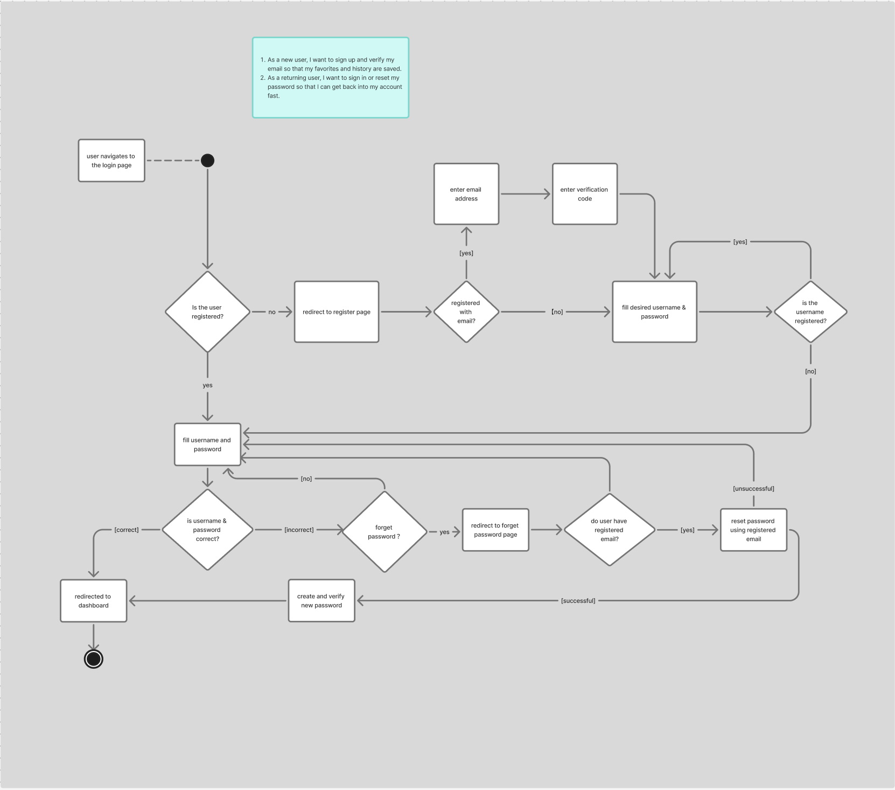
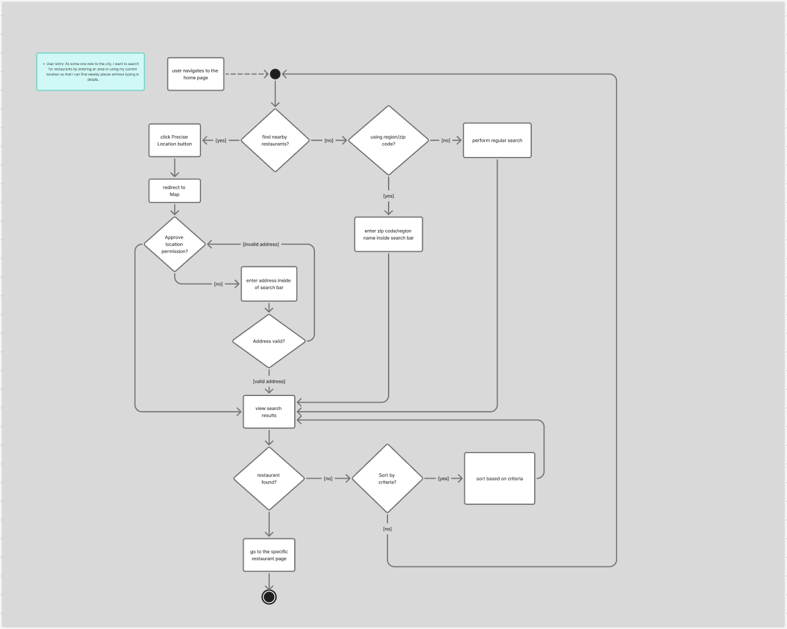

# Specification Phase Exercise

A little exercise to get started with the specification phase of the software development lifecycle. See the [instructions](instructions.md) for more detail.

## Team members

Amy Liu  
Athena Luo  
Mya Pyke  
Kushboo Agrawal  

## Stakeholders
Aly Shiu   
Annie Chen   
Gracie   
Peppa Pai   
Rocky Masci   
Sunidhi Tandel  

## Four Needs/Goals
* Collect and share restaurants with friends with ease.
* Filters for price, dietary restrictions (allergy, vegan/vegetarian), and ambience to match different needs.
* Simple rating system and authentic customer feedback to support better decisions.
* Easy to reserve or to get in the line for a restaurant.

## Four Problems/Frustrations
* Menus and operating hours are not kept up to date.
* Hard to coordinate because friends are in different locations.
* Real-time wait times are missing.
* Sponsored content/ads feel spammy or misleading.

## Product Vision Statement

 *NYC’s trusted dining guide powered by real diners—nearby picks with live hours and wait times, photo-verified reviews, and simple filters, whether you’re eating with friends or solo.*

## User Stories

1. As a new user, I want to sign up and verify my email so that my favorites and history are saved.
2. As a returning user, I want to sign in or reset my password so that I can get back into my account fast.
3. As some one new to the city, I want to search for restaurants by entering an area or using my current location so that I can find nearby places without typing in details.
4. As a friend planner, I want to pick one or more locations on a map (mine and friends’) so that we can see fair, central options together.
5. As an information seeker, I want a restaurant page with photos, live hours, cuisine, price range, and a website link so that I know what to expect.
6. As a visual shopper, I want to view the gallery and rate photo accuracy (1–10) so that others can trust the pictures.
7. As a helpful guest, I want to submit the real wait time I experienced so that other people can plan better.
8. As a reviewer, I want to write a short review and add photos so that I can share my experience.
9. As a collector, I want to save places to Favorites and view my lists (mine, friends’, and all) so that planning with others is easy.
10. As a community member, I want to see my history (visited, reviews, photos) on my dashboard so that I can track and share what I’ve done.
11. As a social diner, I want to find friends and chat in the inbox/DMs—and view a friend’s profile versus a stranger’s—so that I can coordinate and control what I share.

## Activity Diagrams

* As a new user, I want to sign up and verify my email so that my favorites and history are saved.
* As a returning user, I want to sign in or reset my password so that I can get back into my account fast.

  

  

* As some one new to the city, I want to search for restaurants by entering an area or using my current location so that I can find nearby places without typing in details.

  

## Clickable Prototype

[Figma Prototype](https://www.figma.com/proto/SLCo97OuaafxCknkKgHSoW/restaurant-recommendations?page-id=40%3A67&node-id=141-202&viewport=-7579%2C-98%2C0.94&t=XO67QWLvRS9N7drm-1&scaling=scale-down&content-scaling=fixed&starting-point-node-id=141%3A202)
